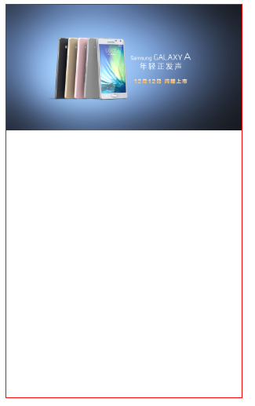

###线性渐变###
-  linear-gradient:线性渐变指沿着某条直线朝一个方向产生渐变效果。

-  语法：linear-gradient( [<point> || <angle>,]? <stop>, <stop> [, <stop>]* )

-  注意渐变产生的是图像，并不是单一色，我们需要只有background 或者 background-image。

-  参数详解：
    第一个参数表示线性渐变的方向，point：指向、 angle：角度 第二个参数：stop：色标 0或多个 */
    第一个参数的取值：

-  角度：向上是0，向右是90，顺时针一周。

    1.to left：设置渐变为从右到左。相当于: 270deg;
    2.to right：设置渐变从左到右。相当于: 90deg; 
    3.to top：设置渐变从下到上。相当于: 0deg;
    4.4.to bottom：设置渐变从上到下。相当于: 180deg。这是默认值，等同于留空不写。也可以直接指定度数，如45deg。

第二个参数是起点颜色,可以指定颜色的位置,位置是百分数。
linear-gradient(方向，开始颜色 位置，颜色2 位置，颜色3 位置...); 
举例：background-image: linear-gradient(to right,red 0%,red 50%,blue 50% ,blue 100%);
###径向渐变###
- radial-gradient径向渐变指从一个中心点开始沿着四周产生渐变效果。

- radial-gradient([ [ <shape> || <size> ][ at  ]? , | at <position>, ]?<color-stop>[ , <color-stop> ]+);

- 注意：添加径向渐变：产生也是图像。

- 参数详解：

    第一个参数我们可以不写默认ellipse center farthest-corner，也可以全都设置。

    第一个参数：shape 形状 ：ellipse椭圆默认值:适配当前的形状,如果是正方形的容器，效果是circle.如果宽高不一样，效果切换到ellipse，
    circle：表示正圆型，如果元素的形状为正方形形状，则ellipse和circle显示一样。
    size 大小: closest-side：最近边； farthest-side：最远边； closest-corner：最近角； farthest-corner：最远角。默认是最远的角farthest-corner。
    举例：background: radial-gradient(circle farthest-side at 50px 50px,red,blue); 
    at position:圆心坐标，默认在正中心。可以赋值坐标（参照元素的左上角），也可以赋值关键字(left center right top bottom)。
    圆心坐标默认是center center，如果只给一个参数，那么纵坐标默认是center。
    举例：    backround: radial-gradient(at 50px 50px red blue);
    设置颜色的位置：
     background: radial-gradient(red,red 50%,blue 50%,blue);
###CSS中背景的新增内容###
####背景平铺####
新增了两个参数：
1. background-repeat: round; round：会将图片进行缩放之后，再平铺。
2. background-repeat: space：不会缩放平铺，会在图片之间产生的相应值。
####背景滚动####
设置在**滚动容器**的背景的行为：跟随滚动/固定

 fixed:背景图片的位置固定不变

 scroll:当滚动容器的时候，背景图片也会跟随滚动*/

  local和scroll的区别：前提是**滚动当前容器的内容**

  local:背景图片会跟随内容一起滚动

  scroll:背景图片不会跟随内容一起滚动

####背景图片大小
  设置背景图片的大小  宽度/高度   宽度/auto(保持比例自动缩放);
  图片可以缩小因为精度会稍高一点，图片不建议放大因为会失真。
  建议：在使用这个属性之前需确定宽高比与容器的宽高比是否一致，否则会造成图片失真变形
  background-size: 300px 500px;
  background-size: 300px;
 设置百分比是**参照父容器可放置内容区域**的百分比
 background-size: 50% 50%; 
 设置contain 按比例调整图片大小，使用图片宽高自适应整个元素的背景区域，使**图片完整的被包含在容器内** .
- background-size: contain; 
1. 图片大于容器：有可能造成容器的空白区域,将图片缩小 

   - 举例：图片大小1920X1026，背景区域300X500

     

     ​

2. 图片小于容器：有可能造成容器的空白区域，将图片放大 

   - 举例：图片大小126x86 背景区域300X500

     
- cover:与contain刚好相反，背景图片会按比例缩放自适应整个背景区域，使**图片铺满整个背景区域**，如果背景区域不足以包含所有背景图片，图片内容会溢出
1. 图片大于容器：等比例缩小，会填满整个背景区域，有可能造成图片的某些区域不可见
2. 图片小于容器：等比例放大，填满整个背景区域，图片有可能造成某个方向上内容的溢出
####背景图片显示原点和背景内容裁切
- 应用场合：提升移动端响应区域的大小。

- 一般来说提升响应区域的大小就是提示盒子的大小，但是也要保证背景图片能够合适的显示。

- 设置背景坐标的原点：参照background-origin原点，这个原点默认在容器的左上角
  设置背景坐标的原点
  border-box:从border的位置开始填充背景，会与border重叠
  padding-box:从padding的位置开始填充背景，会与padding重叠
  content-box:从内容的位置开始填充背景
  background-origin: content-box;

- 设置背景内容的裁切 
    设置内容的裁切:设置的是裁切，控制的是显示
    border-box:其实是显示border及以内的内容
    padding-box:其实是显示padding及以内的内容
    content-box:其实是显示content及以内的内容
    background-clip: content-box;

- 举例：

    ~~~
       /*提升移动端响应区域的大小*/
            a{
                width: 50px;
                height: 50px;
                display: block;
                background-color: #ddd;
                margin:100px auto;
                box-sizing: border-box;
                /* border: 5px solid #000; */
                background-image: url("../images/sprites.png");
                /*设置背景偏移，参照background-origin原点，这个原点默认在容器的左上角*/
                background-position: -20px 0;

                /*添加padding*/
                padding:14px;
                /*设置背景坐标的原点
                border-box:从border的位置开始填充背景，会与border重叠
                padding-box:从padding的位置开始填充背景，会与padding重叠
                content-box:从内容的位置开始填充背景*/
                background-origin: content-box;
                /*设置内容的裁切:设置的是裁切，控制的是显示
                border-box:其实是显示border及以内的内容
                padding-box:其实是显示padding及以内的内容
                content-box:其实是显示content及以内的内容*/
                background-clip: content-box;
            }
    ~~~

    ​

    ### cover 和 container 的相同和差异

    - 相同点：都会自动进行缩放来适应整个背景区域的大小。
    - 不同店：container是把图片缩放到父容器可以完全包容; cover 是把图片缩放到铺满整个父容器的背景区域。

​    