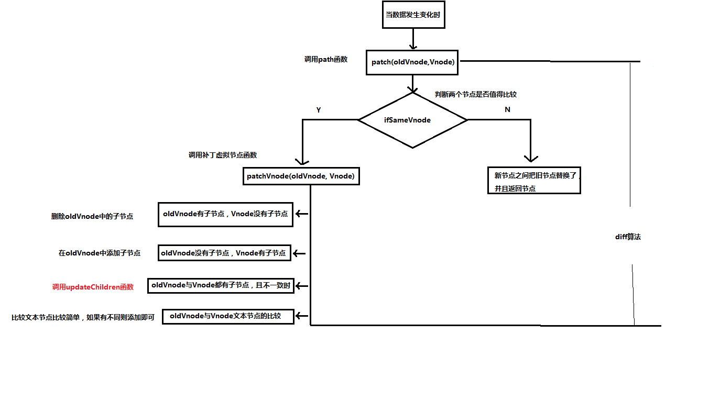
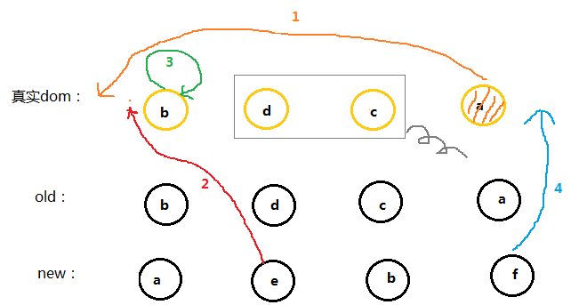

## 虚拟DOM

### 前言

vue2.0加入了virtual dom，有向react靠拢的意思。vue的diff位于[patch.js](https://github.com/vuejs/vue/blob/dev/src/core/vdom/patch.js)文件中。

### vritual DOM

- 如果不了解virtual dom，要理解diff的过程是比较困难的。虚拟dom对应的是真实dom， 使用document.CreateElement和 document.CreateTextNode创建的就是真实节点。

- 要知道渲染真实DOM的开销是很大的，比如有时候我们修改了某个数据，如果直接渲染到真实dom上会引起整个dom树的重绘和重排，有没有可能我们只更新我们修改的那一小块dom而不要更新整个dom呢？diff算法能够帮助我们。

  我们先根据真实DOM生成一颗`virtual DOM`，当`virtual DOM`某个节点的数据改变后会生成一个新的`Vnode`，然后`Vnode`和`oldVnode`作对比，发现有不一样的地方就直接修改在真实的DOM上，然后使`oldVnode`的值为`Vnode`。

  diff的过程就是调用名为`patch`的函数，比较新旧节点，一边比较一边给**真实的DOM**打补丁。

- `VNode`和`oldVNode`都是对象，一定要记住.

### 虚拟DOM的性能比

- 很多时候手工优化dom确实会比virtual dom效率高，对于比较简单的dom结构用手工优化没有问题，但当页面结构很庞大，结构很复杂时，手工优化会花去大量时间，而且可维护性也不高，不能保证每个人都有手工优化的能力。至此，virtual dom的解决方案应运而生，**virtual dom很多时候都不是最优的操作，但它具有普适性，在效率、可维护性之间达平衡。**

### 分析diff

- react的diff其实和vue的diff大同小异。

- 在采取diff算法比较新旧节点的时候，**比较只会在同层级进行, 不会跨层级比较**。

- **如果节点类型不同，直接干掉前面的节点，再创建并插入新的节点，不会再比较这个节点以后的子节点了。**

  **如果节点类型相同，则会重新设置该节点的属性，从而实现节点的更新。**

#### 图示分析diff的比较


例子1：

~~~
<!-- 之前 -->
<div>           <!-- 层级1 -->
  <p>            <!-- 层级2 -->
    <b> aoy </b>   <!-- 层级3 -->   
    <span>diff</Span>
  </P> 
</div>

<!-- 之后 -->
<div>            <!-- 层级1 -->
  <p>             <!-- 层级2 -->
      <b> aoy </b>        <!-- 层级3 -->
  </p>
  <span>diff</Span>
</div>
~~~

- 我们可能期望将`<span>`直接移动到`<p>`的后边，这是最优的操作。但是实际的diff操作是移除`<p>`里的`<span>`在创建一个新的`<span>`插到`<p>`的后边。
  因为新加的`<span>`在层级2，旧的在层级3，属于不同层级的比较。

例子2

- 当某一层有很多相同的节点时，也就是列表节点时，Diff算法的更新过程默认情况下也是遵循以上原则。

比如一下这个情况：


我们希望可以在B和C之间加一个F，Diff算法默认执行起来是这样的：


即把C更新成F，D更新成C，E更新成D，最后再插入E。

### diff算法示意图



### 源码分析

- diff的过程就是调用patch函数，就像打补丁一样修改真实dom。

```javascript
//传入两个虚拟节点，都是对象。其中oldVnodeelel的属性是某个真实的元素，vnode的el现在是null
function patch (oldVnode, vnode) {
	if (sameVnode(oldVnode, vnode)) {
		patchVnode(oldVnode, vnode)
	} else {
		const oEl = oldVnode.el
		let parentEle = api.parentNode(oEl)
		createEle(vnode)
		if (parentEle !== null) {
			api.insertBefore(parentEle, vnode.el, api.nextSibling(oEl))
			api.removeChild(parentEle, oldVnode.el)
			oldVnode = null
		}
	}
	return vnode
}
//虚拟节点里面都有什么属性
// body下的 <div id="v" class="classA"><div> 对应的 oldVnode 就是
{
  el:  div  //对真实的节点的引用，本例中就是document.querySelector('#id.classA')
  tagName: 'DIV',   //节点的标签
  sel: 'div#v.classA'  //节点的选择器
  data: null,       // 一个存储节点属性的对象，对应节点的el[prop]属性，例如onclick , style
  children: [], //存储子节点的数组，每个子节点也是vnode结构
  text: null,    //如果是文本节点，对应文本节点的textContent，否则为null
}
 //需要注意的是，el属性引用的是此 virtual dom对应的真实dom，patch的vnode参数的el最初是null，因为patch之前它还没有对应的真实dom。
```

- 判断两个节点是否值得比较

~~~javascript
function sameVnode(oldVnode, vnode){
	return vnode.key === oldVnode.key && vnode.sel === oldVnode.sel
}
//注意key值，是Vue框架存在一个DOM复用机制，会尽量的回收DOM元素进行复用，而这个机制本身是高效的，但很多时候也会造成不可预知的Bug，而在加了key值后，元素就有了一个标识，复用机制不会复用带key值的元素。而React也存在类似的机制。
~~~

两个vnode的key和sel相同才去比较它们，比如`p`和`span`，`div.classA`和`div.classB`都被认为是不同结构而不去比较它们。

如果值得比较会执行`patchVnode(oldVnode, vnode)`，稍后会详细讲`patchVnode`函数。

- 当节点不值得比较，进入else中。

~~~javascript
else {
		const oEl = oldVnode.el
		let parentEle = api.parentNode(oEl)
		createEle(vnode)
		if (parentEle !== null) {
			api.insertBefore(parentEle, vnode.el, api.nextSibling(oEl))
			api.removeChild(parentEle, oldVnode.el)
			oldVnode = null
		}
	}
//过程如下：
1.取得oldvnode.el的父节点，parentEle是真实dom
2.createEle(vnode)会为vnode创建它的真实dom，令vnode.el =真实dom
3.parentEle将新的dom插入，移除旧的dom
当不值得比较时，新节点直接把老节点整个替换了
最后return vnode。
注意:patch最后会返回vnode，vnode和进入patch之前的不同在哪？没错，就是vnode.el，唯一的改变就是之前vnode.el = null, 而现在它引用的是对应的真实dom。
~~~

- 至此完成一个分支流程

***

- 如果值得比较调用patchVnode函数

~~~javascript
两个节点值得比较时，会调用patchVnode函数

patchVnode (oldVnode, vnode) {
    const el = vnode.el = oldVnode.el
    let i, oldCh = oldVnode.children, ch = vnode.children
    if (oldVnode === vnode) return
    if (oldVnode.text !== null && vnode.text !== null && oldVnode.text !== vnode.text) {
        api.setTextContent(el, vnode.text)
    }else {
        updateEle(el, vnode, oldVnode)
    	if (oldCh && ch && oldCh !== ch) {
	    	updateChildren(el, oldCh, ch)
	    }else if (ch){
	    	createEle(vnode) //create el's children dom
	    }else if (oldCh){
	    	api.removeChildren(el)
	    }
    }
}
//const el = vnode.el = oldVnode.el 这是很重要的一步，让vnode.el引用到现在的真实dom，当el修改时，vnode.el会同步变化。
节点的比较有5种情况

1.if (oldVnode === vnode)，他们的引用一致，可以认为没有变化。

2.if(oldVnode.text !== null && vnode.text !== null && oldVnode.text !== vnode.text)，文本节点的比较，需要修改，则会调用Node.textContent = vnode.text。

3.if( oldCh && ch && oldCh !== ch ), 两个节点都有子节点，而且它们不一样，这样我们会调用updateChildren函数比较子节点，这是diff的核心，后边会讲到。

4.else if (ch)，只有新的节点有子节点，调用createEle(vnode)，vnode.el已经引用了老的dom节点，createEle函数会在老dom节点上添加子节点。

5.else if (oldCh)，新节点没有子节点，老节点有子节点，直接删除老节点。
~~~

***

- 如果两个节点都有子节点，而且它们不一样，这样我们会调用updateChildren函数比较子节点。

~~~javascript
updateChildren (parentElm, oldCh, newCh) {
    let oldStartIdx = 0, newStartIdx = 0
    let oldEndIdx = oldCh.length - 1
    let oldStartVnode = oldCh[0]
    let oldEndVnode = oldCh[oldEndIdx]
    let newEndIdx = newCh.length - 1
    let newStartVnode = newCh[0]
    let newEndVnode = newCh[newEndIdx]
    let oldKeyToIdx
    let idxInOld
    let elmToMove
    let before
    while (oldStartIdx <= oldEndIdx && newStartIdx <= newEndIdx) {
        if (oldStartVnode == null) {   // 对于vnode.key的比较，会把oldVnode = null
            oldStartVnode = oldCh[++oldStartIdx] 
        }else if (oldEndVnode == null) {
            oldEndVnode = oldCh[--oldEndIdx]
        }else if (newStartVnode == null) {
            newStartVnode = newCh[++newStartIdx]
        }else if (newEndVnode == null) {
            newEndVnode = newCh[--newEndIdx]
        }else if (sameVnode(oldStartVnode, newStartVnode)) {
            patchVnode(oldStartVnode, newStartVnode)
            oldStartVnode = oldCh[++oldStartIdx]
            newStartVnode = newCh[++newStartIdx]
        }else if (sameVnode(oldEndVnode, newEndVnode)) {
            patchVnode(oldEndVnode, newEndVnode)
            oldEndVnode = oldCh[--oldEndIdx]
            newEndVnode = newCh[--newEndIdx]
        }else if (sameVnode(oldStartVnode, newEndVnode)) {
            patchVnode(oldStartVnode, newEndVnode)
            api.insertBefore(parentElm, oldStartVnode.el, api.nextSibling(oldEndVnode.el))
            oldStartVnode = oldCh[++oldStartIdx]
            newEndVnode = newCh[--newEndIdx]
        }else if (sameVnode(oldEndVnode, newStartVnode)) {
            patchVnode(oldEndVnode, newStartVnode)
            api.insertBefore(parentElm, oldEndVnode.el, oldStartVnode.el)
            oldEndVnode = oldCh[--oldEndIdx]
            newStartVnode = newCh[++newStartIdx]
        }else {
           // 使用key时的比较
            if (oldKeyToIdx === undefined) {
              oldKeyToIdx = createKeyToOldIdx(oldCh, oldStartIdx, oldEndIdx) // 有key生成index表
            }
            idxInOld = oldKeyToIdx[newStartVnode.key]
            if (!idxInOld) {
                api.insertBefore(parentElm, createEle(newStartVnode).el, oldStartVnode.el)
                newStartVnode = newCh[++newStartIdx]
            }
            else {
                elmToMove = oldCh[idxInOld]
                if (elmToMove.sel !== newStartVnode.sel) {
                    api.insertBefore(parentElm, createEle(newStartVnode).el, oldStartVnode.el)
                }else {
                    patchVnode(elmToMove, newStartVnode)
                    oldCh[idxInOld] = null
                    api.insertBefore(parentElm, elmToMove.el, oldStartVnode.el)
                }
                newStartVnode = newCh[++newStartIdx]
            }
        }
    }
    if (oldStartIdx > oldEndIdx) {
        before = newCh[newEndIdx + 1] == null ? null : newCh[newEndIdx + 1].el
        addVnodes(parentElm, before, newCh, newStartIdx, newEndIdx)
    }else if (newStartIdx > newEndIdx) {
        removeVnodes(parentElm, oldCh, oldStartIdx, oldEndIdx)
    }
}
~~~

### 图示diff算法核心-----updateChildren

- 先说一下这个函数做了什么

  - 将`Vnode`的子节点`Vch`和`oldVnode`的子节点`oldCh`提取出来
  - `oldCh`和`vCh`各有两个头尾的变量`StartIdx`和`EndIdx`，它们的2个变量相互比较，一共有4种比较方式。如果4种比较都没匹配，如果设置了`key`，就会用`key`进行比较，在比较的过程中，变量会往中间靠，一旦`StartIdx>EndIdx`表明`oldCh`和`vCh`至少有一个已经遍历完了，就会结束比较。

- 图解updateChildren

  - 将`Vnode`的子节点`Vch`和`oldVnode`的子节点`oldCh`提取出来，假设oldVnode中有3个子节点，Vnode中有4个子节点。粉红色的部分为oldCh，黄色部分为vch。

    ​

    

- 我们将它们取出来并分别用s和e指针指向它们的头child和尾child

  

- 现在分别对`oldS、oldE、S、E`两两做`sameVnode`比较，有四种比较方式，**当其中两个能匹配上那么真实dom中的相应节点会移到Vnode相应的位置**，这句话有点绕，打个比方

  - 如果是oldS和E匹配上了，那么真实dom中的第一个节点会移到最后
  - 如果是oldE和S匹配上了，那么真实dom中的最后一个节点会移到最前，匹配上的两个指针向中间移动
  - 如果四种匹配没有一对是成功的，那么遍历`oldChild`，`S`挨个和他们匹配，匹配成功就在真实dom中将成功的节点移到最前面，如果依旧没有成功的，那么将`S对应的节点`插入到dom中对应的`oldS`位置，`oldS`和`S`指针向中间移动。

- 举例图示说明上述过程

  

- 第一步

```
oldS = a, oldE = d；
S = a, E = b;
```

`oldS`和`S`匹配，则将dom中的a节点放到第一个，已经是第一个了就不管了，此时dom的位置为：a b d

- 第二步

```
oldS = b, oldE = d；
S = c, E = b;
```

`oldS`和`E`匹配，就将原本的b节点移动到最后，因为`E`是最后一个节点，他们位置要一致，这就是上面说的：**当其中两个能匹配上那么真实dom中的相应节点会移到Vnode相应的位置**，此时dom的位置为：a d b

- 第三步

```
oldS = d, oldE = d；
S = c, E = d;
```

`oldE`和`E`匹配，位置不变此时dom的位置为：a d b

- 第四步

```
oldS++;
oldE--;
oldS > oldE;
```

遍历结束，说明`oldCh`先遍历完。就将剩余的`vCh`节点根据自己的的index插入到真实dom中去，此时dom位置为：a c d b。一次模拟完成。

**这个匹配过程的结束有两个条件**：

- `oldS > oldE`表示`oldCh`先遍历完，那么就将多余的`vCh`根据index添加到dom中去（如上图）。
- `S > E`表示vCh先遍历完，那么就在真实dom中将区间为`[oldS, oldE]`的多余节点删掉

***

- 再来几个例子

  

