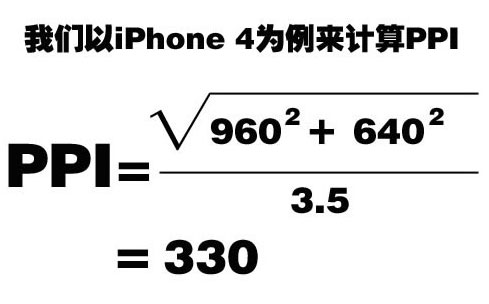

### 移动端基础知识

#### 移动端屏幕相关知识

##### 移动端屏幕大小

- 移动设备与PC设备最大的差异在于屏幕，这主要体现在**屏幕尺寸和屏幕分辨率两个方面**。

​      通常我们所指的屏幕尺，实际上指的是屏幕对角线的长度（一般用英寸来度量）。

##### 分辨率

- 分辨率则一般**用像素来度量 px**，表示屏幕水平和垂直方向的像素数，例如1920*1080指的是屏幕垂直方向和水平方向分别有1920和1080个像素点而构成。

##### 长度单位

- Web开发中可以使用px（像素）、em、pt（点）、in（英寸）、cm（厘米）做为长度单位，我们最常用px（像素）做为长度单位，将上述的几种长度单位划分成**相对长度单位和绝对长度单位**。
- 英寸是一个绝对长度单位，而像素是一个相对长度单位（像素并没有固定的长度）。
- **rem：**相对单位，可理解为”root em”, 相对根节点html的字体大小来计算，CSS3新加属性，chrome/firefox/IE9+支持。
- vx：(viewport-px)视口像素，1vw等于视窗宽度的1%，可以根据视口的大小而发生变化。
- vh：(viewpoint height)视窗高度，1vh等于视窗高度的1%，可以根据视口的大小而发生变化。
- vw, vh, vmin, vmax：IE9+局部支持，chrome/firefox/safari/opera支持，ios safari 8+支持，android browser4.4+支持，chrome for android39支持

### rem（root em）

- rem是CSS3中新增的一个长度单位，它是参照根元素（html）的字号。

##### rem

- rem与媒体查询配合使用。

- 通常我们需要根据ui的稿件，来设置rem的大小。通常ui的稿件为640px和750px，我们采用rem做为单位。

  比如：我们想让一个元素不论在320px的屏幕上还是375的屏幕上都占据一半。

  首先：我们自己指定一个数值：就是不论ui的稿件为640px和750px我们都平均分成指定的份数。

  假设我们分为：20份（即20个rem），当然每个rem对应的px比例是变化的，需要通过媒体查询来做。

  ~~~
  /* 把设计稿分为20份，即使20个rem。
  * 当然在不同的屏幕下，每个rem对应的px比例都是变化的
  * 我们需要通过媒体查询来查询设备的屏幕宽度，然后计算设备宽度
  * 除以份数（20），得到适合当前屏幕下rem的大小。
  * rem的大小通过：html的font-size来设置。
  * 1rem就是对应一个html的font-size。
  */
  @media screen and (device-width: 320px) {
      html {
          font-size: 16px;
      }
  }
  @media screen and (device-width: 360px) {
      html {
          font-size: 18px;
      }
  }
  @media screen and (device-width: 375px) {
      html {
          font-size: 18.75px;
      }
  }
  @media screen and (device-width: 414px) {
      html {
          font-size: 20.07px;
      }
  }
  /* 通过上面的媒体查询，我们就可以设置一个元素的宽为10rem，
  * 这样不论在那个屏幕下，该元素都占据当前屏幕宽度的一半
  */
  ~~~

##### em

- em是相对长度单位。**相对于当前对象内文本的字体尺寸**。如当前对行内文本的字体尺寸未被人为设置，则相对于浏览器的默认字体尺寸。
- 任意浏览器的默认字体高都是16px。所有未经调整的浏览器都符合: 1em=16px。那么12px=0.75em,10px=0.625em。为了简化font-size的换算，需要在css中的body选择器中声明Font-size=62.5%，这就使em值变为 16px*62.5%=10px相当于1em=10px, 这样12px=1.2em,  也就是说只需要将你的原来的px数值除以10，然后换上em作为单位就行了。
- em的特点：1. em的值并不是固定的；2. em会继承父级元素的字体大小。
- 所以我们在写CSS的时候，需要注意几点：
  1. body选择器中声明Font-size=62.5%；
  2. 将你的原来的px数值除以10，然后换上em作为单位；
  3. 重新计算那些被放大的字体的em数值。避免字体大小的重复声明。

##### 详解felxible.js 插件

~~~
// 封装自执行函数
(function flexible(window, document) {
    // 获取根元素 html
    var docEl = document.documentElement
    // window.devicePixelRatio 
    // 设备物理像素(px)和设备独立像素(dp)的比例,
    // 如果没有那么就取1，即1dp等于1px
    var dpr = window.devicePixelRatio || 1

    // adjust body font size
    // 调整字体大小
    function setBodyFontSize() {
        if (document.body) {
            // 把字体大小设置为12 dp 。
            document.body.style.fontSize = (12 * dpr) + 'px'
        } else {
            document.addEventListener('DOMContentLoaded', setBodyFontSize)
        }
    }
    setBodyFontSize();

    // set 1rem = viewWidth / 10
    //   设计图是 750px 推荐改成 7.5
    //   设计图如果是640px  推荐改成  6.4
    function setRemUnit() {
        // 获取当前屏幕的宽度，除以7.5,是把设计图分为7.5份（7.5个rem），这个rem在当前设计图对应的100px像素。
        // 我们可以自己定义要分割的份数，但是最好保证当前rem对应的px为整数。
        var rem = docEl.clientWidth / 7.5
        docEl.style.fontSize = rem + 'px'
    }

    setRemUnit()

    // reset rem unit on page resize
    // 在屏幕大小发生变化时，即我们在模拟器上进行拖拽时，重新调用设置rem的函数
    window.addEventListener('resize', setRemUnit)
    // 在网页重新加载，指从浏览器缓存中获取页面，经常用于前进和后退场合。
    window.addEventListener('pageshow', function(e) {
        if (e.persisted) {
            setRemUnit()
        }
    })
    // detect 0.5px supports
    // 查明0.5px的支持
    // 如果dp>=2,1dp >= 1 px,此时重新生成body，div
    if (dpr >= 2) {
        var fakeBody = document.createElement('body')
        var testElement = document.createElement('div')
        testElement.style.border = '.5px solid transparent'
        fakeBody.appendChild(testElement)
        docEl.appendChild(fakeBody)
        if (testElement.offsetHeight === 1) {
            // 这个class类名在哪啊？
            docEl.classList.add('hairlines')
        }
        docEl.removeChild(fakeBody)
    }
}(window, document))
~~~


##### 像素详解

- 像素密度：、DPI(Dots Per Inch是印刷行业中用来表示打印机每英寸可以喷的墨汁点数，计算机显示设备从打印机中借鉴了DPI的概念，由于计算机显示设备中的最小单位不是墨汁点而是像素，所以用PPI（Pixels Per Inch）值来表示**屏幕每英寸的像素数量**.

- 我们将PPI(Pixels Per Inch）、DPI(Dots Per Inch）都称为像素密度，但PPI应用更广泛，DPI在Android设备比较常见。

- 计算像素密度

- 利用 **勾股定理** 我们可以计算得出PPI

  例如iphone4的屏幕分辨率是960px 640px，屏幕尺寸是3.5.



PPI值的越大说明单位尺寸里所能容纳的像素数量就越多，所能展现画面的品质也就越精细，反之就越粗糙。

- Retina即视网膜屏幕，苹果注册的命名方式，意指具有较高PPI（大于320）的屏幕。

思考：在屏幕尺寸（英寸）固定时，PPI和像素大小的关系？

结论：屏幕尺寸固定时，当PPI 越大，像素的实际大小就会越小，当PPI越小，像素实际大小就越大。

##### 设备独立像素

- 假设你设计了一个163x163像素的蓝色方块，在PPI为163的屏幕上，那这个方块看起来正好就是1x1寸大小，在PPI为326的屏幕上，这个方块看起来就只有0.5*0.5寸大小了。
- 需要一个新的单位，这个新的单位能够保证图像内容在不同的PPI设备看上去大小应该差不多，这就是独立像素，**在IOS设备上叫PT(Point)，Android设备上叫DIP(Device independent Pixel)或DP**。
- dp同px是有一个对应（比例）关系的，这个对应（比例）关系是**操作系统确定并处理**，目的是确保不同PPI屏幕所能显示的图像大小是一致的，通过**window.devicePixelRatio**可以获得该比例值

##### 物理像素和CSS像素

- 物理像素指的是屏幕渲染图像的最小单位，属于屏幕的物理属性，不可人为进行改变，其值大小决定了屏幕渲染图像的品质，我们以上所讨论的都指的是物理像素。

  ~~~	
  // 获取屏幕的物理像素尺寸
  window.screen.width;
  window.screen.height;
  // 部分移动设备下获取会有错误，与移动开发无关，只需要了解
  ~~~

- CSS像素指的是通过CSS进行网页布局时用到的单位，其默认值(PC端)是和物理像素保持一致的（1个单位的CSS像素等于1个单位的物理像素），但是我们可通缩放来改变其大小

- 我们需要理解的是物理像素和CSS像素的一个关系，**1个物理像素并不总是等于一个CSS像素，通过调整浏览器缩放比例**。

### 视口

#### 视口的作用：

视口（viewport）是用来约束网站中最顶级块元素<html>的，即它决定了<html>的大小。

#### PC端的视口

在PC设备上viewport的大小取决于浏览器窗口的大小，以CSS像素做为度量单位。

~~~
// 获取viewport的大小
document.documentElement.clientWidth;
document.documentElement.clientHeight;
~~~

总结：在PC端，我们通过调整浏览器窗口可以改变viewport的大小，为了保证网页布局不发生错乱，需要给元素设定较大固定宽度。

#### 移动端的视口

- 移动设备屏幕普遍都是比较小的，但是大部分的网站又都是为PC设备来设计的，要想让移动设备也可以正常显示网页，移动设备不得不做一些处理，通过上面的例子我们可以知道**只要viewport足够大，就能保证原本为PC设备设计的网页也能在移动设备上正常显示，移动设备厂商也的确是这样来处理的**。

- 在移动设备上viewport不再受限于浏览器的窗口，而是允许开发人员自由设置viewport的大小，通常浏览 器会设置一个默认大小的viewport，为了能够正常显示那些专为PC设计的网页，一般这个值的大小会大于屏幕的尺寸。常见的默认viewport大小。

  ​


- layout viewport(布局视口)

  指的是我们可以进行网页布局区域的大小，同样是以CSS像素做为计量单位，可以通过下面方式获取

  ~~~
  // 获取layout viewport
  document.documentElement.clientWidth;
  document.documentElement.clientHeight;
  ~~~

  果要保证为PC设计的网页在移动设备上布局不发生错乱，**移动设备会默认设置一个较大的viewport（如IOS为980px），这个viewport实际指的是layout viewport**

- ideal viewport（理想视口）设备屏幕区域

  以设备独立像素PT、DP做为单位,以CSS像素做为计量单位，其大小是不可能被改变，通过下面方式可以获取。

  ~~~
  // 获取ideal viewport有两种情形
  // 新设备
  window.screen.width;
  window.screen.height;
  // 老设备
  window.screen.width / window.devicePixelRatio;
  window.screen.height / window.devicePixelRatio;
  ~~~

  ​

### 屏幕适配

- viewport 是由苹果公司为了解决移动设备浏览器渲染页面而提出的解决方案，后来被其它移动设备厂商采纳解决。


- **移动页面最理想的状态是：避免滚动条且不被默认缩放处理**，我们可以通过设置<meta name="viewport" content="">来进行控制，并改变浏览器默认的layout viewport的宽度。

- content属性：设置属性content=""，中间以逗号分隔。

  ~~~
  <meta name="viewport" content="width=device-width">
  width 设置layout viewport 宽度，其取值可为数值或者device-width。
  initital-scale设置页面的初始缩放值，为一个数字，可以带小数。
  maximum-scale允许用户的最大缩放值，为一个数字，可以带小数。
  minimum-scale允许用户的最小缩放值，为一个数字，可以带小数。
  user-scalable是否允许用户进行缩放，值为"no"或"yes"。
  ~~~

  ​


### 真机调试

- 真机调试
  - 手机和电脑必须在同一个网络下
  - 将页面以live server的形式打开
  - 打开运行cmd输入ipconfig查找到无线局域网的wlan  ipv4地址将ip地址复制之后将浏览器中的127.0.0.1替换掉
  - 将地址用二维码生成器生成二维码，然后手机扫一扫即可

#### 

### 移动端特有的touch事件

- touchstart: 手指触摸屏幕时触发，只触发一次。
- touchmove: 手指在屏幕上移动时触发，是持续事件。
- touchend: 手指离开屏幕时触发，只触发一次。

#### touchEvent事件对象参数

- 我们一般用简写e的形式表示touchEvent事件对象参数。
- touches：纪录当前屏幕上所有的手指对象。
- targetTouches：纪录当前元素上的手指对象，建议使用这个。
- changedTouches：当前屏幕上状态发生变化的手指对象--从无到有，从有到无。
- 注意：touches和targetTouches在调试过程中没有区别。
- 这三个对象中都以属性的形式记录了手指的坐标信息。
  - screenX：手指触摸点相对于设备显示器的左上角的距离。
  - screenY:  手指触摸点相对于设备显示器的左上角的距离。
  - clientX：手指触摸点相对于浏览器视口左上角的距离。
  - clientY:   手指触摸点相对于浏览器视口左上角的距离。
  - pageX:   手指触摸点相对于文档页面的左上角距离，包含滚动出去的距离。
  - pageY:   手指触摸点相对于文档页面的左上角距离，包含滚动出去的距离。
- target ：真正触发事件的元素（事件源）。多用于给屏幕上所有的元素注册touch事件（一般是给doucument注册），用于分辨到底是哪个元素触发了事件。

### 去除移动端有事件监听的元素被点击的时候会被高亮显示

1. -webkit-tap-highlight-color:rgba(0,0,0,0) 
2. webkit是苹果浏览器引擎，tap点击，highlight背景高亮，color颜色，颜色用数值调节。

### webkitTransitionEnd

- webkit是前缀，处理兼容性。当过渡动画完成后触发事件。

### zepto.js 框架

- 简介：zepto与JQ的功能大概相同，用法也相同。
- 区别在于：1.zepto是专为移动端而开发的（H5C3适配较好），相比于JQ而言少了许多浏览器的兼容性处理，所以重量级更轻。
- 2. zepto是把功能分成相应的模块，需要时引入即可。

#### animate详解

- zepto中的animate是把css3中的过渡动画，封装在fx模块。如果使用该方法需要引入fx功能模块。
- animate语法：
  - element.animate({properties:value},animateduration,aniamte-time-function,complete);
  - element是在zepto中获取的元素，给这个元素添加过渡动画。
  - {properties:value}描述符对象，是需要过渡的属性和属性值。
  - animateduration: 动画耗时,单位是s.
  - **complete**:回调函数，当过渡动画完成后调用，这个属性比较重要。


### 移动端click的延迟

- 移动端click延迟的原因。
  - 早期移动设备浏览器网页时内容非常小，为了增强用户体验，苹果公司专门为移动设备设计了双击放大的功能，确保用户可以非常方便的放大网页内容，但是当用户单击一个按钮时，**移动设备会延时（约300ms）执行，判断用单是否要双击**。

### 利用touch封装单击事件

#### 单击事件的封装（主要是利用touch事件）

* 单击操作的特点

​     1.单击只有一根手指

​     2.判断手指开始触摸和手指松开的时间差异不能大于指定的值  300/150

​     3.保证没有滑动操作，如果有抖动必须保证抖动的距离在指定范围内。

### zepto的tap事件

- zepto.js封装了tap事件，但是有**并没有完全解决点透问题** （时而有，时而无）。

  ~~~
  在zepto在努力解决这个问题，但是没有完全解决。
  $(".tap").on("tap",function(){
          $(this).hide();
      });
      $(".click").on("click",function(){
          console.log("abc");
      });
  ~~~

  ​

### touch的点透

#### 什么是点透

- 当一个A元素注册了touch事件，另一个兄弟元B素注册了click事件,A定位在B上面,此时在移动端模拟器里触摸A元素，然后A元素隐藏，B元素的click事件也触发了（这并不是事件流，因为A、B元素不是父子关系）。

  ~~~

  <div class="box">
      <div class="click">click</div>
      <div class="tap">tap</div>
  </div>
  var tap=document.querySelector(".tap");
      var click=document.querySelector(".click");
  /*为tap添加touch事件*/
   tap.addEventListener("touchstart",function(){
   //注册touch事件的元素，需要隐藏。因为鼠标需要落入到click元素上才会产生点透现象。
          tap.style.visibility="hidden";
       });
   // 为click添加click事件
      click.onclick=function(){
          console.log(123);
      }
  ~~~


#### 点透发生的条件

- 注册touch事件的元素必须在注册click元素的上面，因为移动端touch优先触发，而click会延迟。
- 注册touch事件的元素必须在触发touch事件后必须隐藏，因为需要是鼠标落入到注册到click事件元素的上面。

### FirstClick插件的作用

- 满足以下的需求：1.在pc和移动端都能响应--click  2.不能点透--click 3.操作不能有延迟--touch

#### 使用方法

- 引入相关文件  zepto.min.js

- 初始化 

  ~~~
  if ('addEventListener' in document) {
          document.addEventListener('DOMContentLoaded', function() {
              /!*参数可以是任意的dom元素，如果写document.body，说明会将document.body下面的所的元素都绑定fastclick*!/
              FastClick.attach(document.body);
          }, false);
  ~~~

  ​

- 调用方法：

  ~~~
    $(function() {
         FastClick.attach(document.body);
       });

       tap.addEventListener("click",function(){
           tap.style.visibility="hidden";
       })
       click.addEventListener("click",function(){
         console.log(123);
      })
  ~~~

  ​

### Iscrol插件的使用

能够实现手动拖拽的效果

- ```
  //需要这样的结果，而不是一模一样的标签。
  <div id="wrapper">
      <ul>
          <li>...</li>
          <li>...</li>
          ...
      </ul>
  </div>
  ```


- 引入iscroll.js文件

-  var myScroll = new IScroll('#wrapper',{

  ​        mouseWheel: true,

  ​        scrollbars: true

  ​    });

### swiper轮播插件的使用

- 在线网站https://www.swiper.com.cn/

- 建议使用swiper3的api说明。

- 加载插件，需要用到的文件有[swiper.min.js](https://3.swiper.com.cn/download/index.html#file7)和[swiper.min.css](https://3.swiper.com.cn/download/index.html#file5)文件。

  ~~~
  //因为有引入的css样式文件，所以我们需要保持结构一致的同时，保持类名一致。
  <div class="swiper-container">
      <div class="swiper-wrapper">
          <div class="swiper-slide">Slide 1</div>
          <div class="swiper-slide">Slide 2</div>
          <div class="swiper-slide">Slide 3</div>
      </div>
  ~~~

  ​

### 前端布局

1、固定宽度布局：为网页设置一个固定的宽度，通常以px做为长度单位，常见于PC端网页。

2、流式布局：为网页设置一个相对的宽度，通常以百分比做为长度单位。

3、栅格化布局：将网页宽度人为的划分成均等的长度，然后排版布局时则以这些均等的长度做为度量单位，通常利用百分比做为长度单位来划分成均等的长度。

4、响应式布局：通过检测设备信息，决定网页布局方式，即用户如果采用不同的设备访问同一个网页，有可能会看到不一样的内容，一般情况下是检测设备屏幕的宽度来实现。

5、flex布局

注：以上几种布局方式并不是独立存在的，实际开发过程中往往是相互结合使用的。

### 响应式布局

就是通过一套代码来实现不同屏幕分辨率的终端上浏览网页的不同展示方式

a)      在移动互联日益成熟的时候，桌面浏览器上开发的网页已经不能满足移动端的设备的展示和阅读

b)      之前，通常的做法是对移动端单独开发一套特定的版本

c)       但是，如果移动终端设备起来越多的时候赋发成本太大，是因为需要做所有屏幕的适配

d)      响应式开发的目的就是:一个网站能够兼容多种终端

e)      在新建的网站上一般都会使用响应式开发

f)       移动web开发和响应式开发是必须具备的技能 

g)      演示响应者页面

响应式开发的原理就是媒体查询

### 媒体查询

#### 媒体查询语法

~~~
@media mediatype and|not|only (media feature) {
    CSS-Code;
}
你也可以针对不同的媒体使用不同 stylesheets :
<link rel="stylesheet" media="mediatype and|not|only (media feature)" href="mystylesheet.css">
媒体类型
值			描述
all				用于所有设备
print			用于打印机和打印预览
screen			用于电脑屏幕，平板电脑，智能手机等。
speech			应用于屏幕阅读器等发声设备
媒体功能
device-height			定义输出设备的屏幕可见高度。
device-width			定义输出设备的屏幕可见宽度。
max-device-height		定义输出设备的屏幕可见的最大高度。
max-device-width		定义输出设备的屏幕最大可见宽度。
min-device-width		定义输出设备的屏幕最小可见宽度。
min-device-height		定义输出设备的屏幕的最小可见高度。
max-height				定义输出设备中的页面最大可见区域高度。
max-width				定义输出设备中的页面最大可见区域宽度。
min-height				定义输出设备中的页面最小可见区域高度。
min-width				定义输出设备中的页面最小可见区域宽度。
~~~


由于移动端（手机）类型的多样化，我们需要获取移动端的类型信息，才有机会实现网页适应不同终端的展示风格

媒体查询能够判断不同的屏幕设置不同的css样式

小于768  超小屏幕 （手机端）xs  extra small

768-992   小屏幕  （平板）sm  samll

992-1200  中等屏幕   （pc端的中等屏幕） md  middle

1200以上   超大屏   （pc中的大屏）lg  large

在写媒体查询的时候 and前后必须要有空格，如果有两个条件，也用and链接

```
@media screen and (max-width: 768px){
	body{
		background-color: green;
	}
}
@media screen and (min-width: 768px) and (max-width: 992px){
  body{
  	background-color: blue;
  }
}
```

- min-width：判断最小宽，也就是要大于这个条件
- max-width：判断最大宽，也就是要小于这个条件

#### 媒体查询书写规则

如果判断的min-width，从小到大去写

向上兼容：如果该条件为最后一个条件，那么他会无止境的把大于当前条件的屏幕全都有效

向下覆盖：后面条件的样式，会覆盖前面条件的样式

如果判断的max-width，从大到下去写

device-width：是用来判断设备的宽度，在模拟器上改变屏幕的大小是没有没问题的，但是在pc端就会有问题

link标签也可以设置媒体查询，如果符合条件，该样式就引入成功

```
<link rel="stylesheet" media="screen and (min-width:992px) and (max-width:1200px)" href="b.css">
```

not：将条件取反

### 响应式框架介绍

1. bootstrap
2. Amaze ~ 妹子UI，国人开发，后起之秀！

### CSS(预处理器)

CSS 预处理器是一种语言，用来为 CSS 增加一些编程的的特性，无需考虑浏览器的兼容性问题，并且你可以在 CSS 中使用变量、简单的程序逻辑、函数等等在编程语言中的一些基本技巧，可以让你的 CSS 更简洁，适应性更强，代码更直观等诸多好处。

常见的CSS预处理器有：LESS、SASS、Stylus等

其使用方法大致相同，我们在这里以LESS为例进行学习

#### LESS语法

- less可以进行逻辑运算：+ - * /


- 注释：/**/  会解析  // 。这样的注释只在less里面存在

- 变量：@变量名：变量值

  ```
  @baseColor:red;
  ```

- 混入：就是定义一组样式，供给调用，调用的时候可以传参也可以不传参

  ```
  .addRadius(@r:10px){
    border-radius: @r;
    -webkit-border-radius: @r;
    -moz-border-radius: @r;
  }
  div{
    .addRadius
    .addRadius(10px)
  }
  ```

- 嵌套：嵌套就是可以省略一些没有必要的重复代码，同时可以实现选择的嵌套,利用&实现交集

  ```
  .box{
    ul{
      color:red;
      li{
        color:red;
        &::before{
          content: '';
        }
      }
    }
  }
  ```

- 直接引入less文件

  ~~~
  首先：把stylesheet默认的文件格式txt，改为"stylesheet/less。
  <link rel="stylesheet/less" href="./css/index.less">
  其次：引入解析less文件的js插件：less.js
  <script src="./js/less.js"></script>
  ~~~

- 在less文件中导入其他的less文件

  ~~~
  @import 'base.less';
  ~~~

  ​